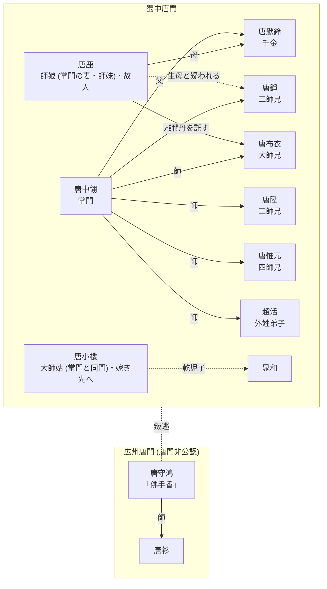
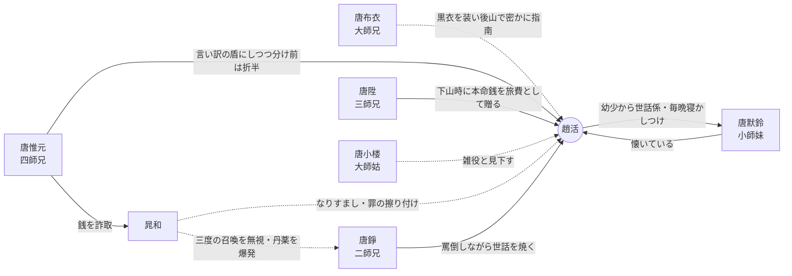
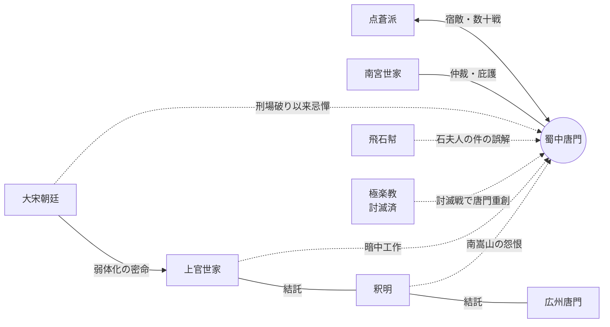

# {{ $frontmatter.title }}

::: warning ネタバレ注意
このページは物語終盤までの人物関係のネタバレを**区別なく**含みます。
:::

関係の種類ごとに図を分けています。1枚の図にすべての関係を詰め込むと読めなくなるため、「師承・家族」「対外的な因縁」のように図ごとに主題を固定しています。

- **実線** … 作中で確定している関係
- **破線** … 疑い・非公式・一方的な関係

## 蜀中唐門 — 師承・家族図

横の並びが同じ段の人物は同世代 (同じ輩分) です。同世代内の関係 (夫婦・同門) はノード内の肩書きに記しています。

- [唐鹿](/ja/people/characters/other10) は [唐中翎](/ja/people/characters/master) の師妹にして妻。[極楽教](/ja/people/factions/elysium-school) の『屍心丹』に中毒して支配されていた間に [唐錚](/ja/people/characters/brother2) を生んだと疑われた。[唐默鈴](/ja/people/characters/girl0) を [趙活](/ja/people/characters/player) に託した後、崖に身を投げた。
- [唐陞](/ja/people/characters/brother3) は刑場破りの折、まだ掌門就任前の [唐中翎](/ja/people/characters/master) が少年の [唐布衣](/ja/people/characters/brother1)・[唐錚](/ja/people/characters/brother2) を率いて救い出した縁で唐門に入った。
- [唐小楼](/ja/people/characters/aunt2) は講経楼に二十年座った大師姑。すでに嫁ぎ出たが折々戻っては輩分を振りかざす。子がなく、[晁和](/ja/people/characters/special208) を乾児子として溺愛している。
- 広州唐門は叛逃者「佛手香」[唐守鴻](/ja/people/characters/special812) が開いた分院で、唐門はこれを認めていない。弟子に [唐衫](/ja/people/characters/special811) がいる。
- 失伝した真の万霊丹は、[唐鹿](/ja/people/characters/other10) が [唐布衣](/ja/people/characters/brother1) に与えた一份だけが残る。同時に贈られたガラスの花は唐門の暗器『無形箭』。

## 蜀中唐門 — 弟子世代の間柄図

弟子世代どうしの個人間の間柄です。この図には段と世代の対応はありません。

### Mermaid 版

### SVG 版

<svg viewBox="0 0 920 640" role="img" aria-label="蜀中唐門 弟子世代の間柄図" style="max-width:100%;height:auto;display:block;margin:0 auto;">
  <defs>
    <marker id="rc-ar-warm" markerUnits="userSpaceOnUse" markerWidth="12" markerHeight="10" refX="11" refY="5" orient="auto"><path d="M0,0 L12,5 L0,10 z" fill="#d98a2b"/></marker>
    <marker id="rc-ar-neu" markerUnits="userSpaceOnUse" markerWidth="12" markerHeight="10" refX="11" refY="5" orient="auto"><path d="M0,0 L12,5 L0,10 z" fill="#8a8f98"/></marker>
    <marker id="rc-ar-neg" markerUnits="userSpaceOnUse" markerWidth="12" markerHeight="10" refX="11" refY="5" orient="auto"><path d="M0,0 L12,5 L0,10 z" fill="#d64545"/></marker>
    <marker id="rc-ar-cov" markerUnits="userSpaceOnUse" markerWidth="12" markerHeight="10" refX="11" refY="5" orient="auto"><path d="M0,0 L12,5 L0,10 z" fill="#4a7dd6"/></marker>
    <clipPath id="rc-c-player"><circle cx="460" cy="300" r="40"/></clipPath>
    <clipPath id="rc-c-b1"><circle cx="150" cy="110" r="40"/></clipPath>
    <clipPath id="rc-c-b2"><circle cx="770" cy="110" r="40"/></clipPath>
    <clipPath id="rc-c-b3"><circle cx="120" cy="330" r="40"/></clipPath>
    <clipPath id="rc-c-b4"><circle cx="200" cy="520" r="40"/></clipPath>
    <clipPath id="rc-c-ml"><circle cx="790" cy="350" r="40"/></clipPath>
    <clipPath id="rc-c-chao"><circle cx="620" cy="540" r="40"/></clipPath>
    <clipPath id="rc-c-aunt"><circle cx="460" cy="80" r="40"/></clipPath>
  </defs>
  <line class="rc-e rc-cov" x1="190.9" y1="135.1" x2="415.7" y2="272.9" marker-end="url(#rc-ar-cov)"/>
  <line class="rc-e rc-neu" x1="729.1" y1="135.1" x2="504.3" y2="272.9" marker-end="url(#rc-ar-neu)"/>
  <line class="rc-e rc-warm" x1="167.8" y1="325.8" x2="408.2" y2="304.6" marker-end="url(#rc-ar-warm)"/>
  <line class="rc-e rc-neu" x1="236.6" y1="489" x2="420.3" y2="333.6" marker-end="url(#rc-ar-neu)"/>
  <line class="rc-e rc-warm" x1="507.5" y1="298.2" x2="738.6" y2="333.2" marker-end="url(#rc-ar-warm)"/>
  <line class="rc-e rc-warm" x1="738.6" y1="351.2" x2="507.5" y2="316.2" marker-end="url(#rc-ar-warm)"/>
  <line class="rc-e rc-neg" x1="593.4" y1="500.1" x2="488.9" y2="343.3" marker-end="url(#rc-ar-neg)"/>
  <line class="rc-e rc-neg" x1="460" y1="128" x2="460" y2="248" marker-end="url(#rc-ar-neg)"/>
  <line class="rc-e rc-neu" x1="248" y1="522.3" x2="568.1" y2="537.5" marker-end="url(#rc-ar-neu)"/>
  <line class="rc-e rc-neg" x1="635.8" y1="494.7" x2="752.9" y2="159.1" marker-end="url(#rc-ar-neg)"/>
  <text class="rc-lab" x="300" y="195">黒衣で密かに指南</text>
  <text class="rc-lab" x="625" y="195">罵倒しつつ世話を焼く</text>
  <text class="rc-lab" x="288" y="299">本命銭を旅費に贈る</text>
  <text class="rc-lab" x="328" y="405">言い訳の盾/分け前折半</text>
  <text class="rc-lab" x="620" y="296">幼少から世話係</text>
  <text class="rc-lab" x="623" y="352">懐いている</text>
  <text class="rc-lab" x="545" y="418">なりすまし・罪の擦り付け</text>
  <text class="rc-lab" x="460" y="178">雑役と見下す</text>
  <text class="rc-lab" x="410" y="512">銭を詐取</text>
  <text class="rc-lab" x="648" y="466">召喚無視・丹薬爆発</text>
  <image href="/images/characters/player/normal.webp" x="420" y="260" width="80" height="80" preserveAspectRatio="xMidYMin slice" clip-path="url(#rc-c-player)"/>
  <circle class="rc-n" cx="460" cy="300" r="40"/>
  <text class="rc-name" x="460" y="358">趙活</text>
  <text class="rc-role" x="460" y="374">外姓弟子</text>
  <image href="/images/characters/brother1/normal.webp" x="110" y="70" width="80" height="80" preserveAspectRatio="xMidYMin slice" clip-path="url(#rc-c-b1)"/>
  <circle class="rc-n" cx="150" cy="110" r="40"/>
  <text class="rc-name" x="150" y="168">唐布衣</text>
  <text class="rc-role" x="150" y="184">大師兄</text>
  <image href="/images/characters/brother2/normal.webp" x="730" y="70" width="80" height="80" preserveAspectRatio="xMidYMin slice" clip-path="url(#rc-c-b2)"/>
  <circle class="rc-n" cx="770" cy="110" r="40"/>
  <text class="rc-name" x="770" y="168">唐錚</text>
  <text class="rc-role" x="770" y="184">二師兄</text>
  <image href="/images/characters/brother3/normal.webp" x="80" y="290" width="80" height="80" preserveAspectRatio="xMidYMin slice" clip-path="url(#rc-c-b3)"/>
  <circle class="rc-n" cx="120" cy="330" r="40"/>
  <text class="rc-name" x="120" y="388">唐陞</text>
  <text class="rc-role" x="120" y="404">三師兄</text>
  <image href="/images/characters/brother4/normal.webp" x="160" y="480" width="80" height="80" preserveAspectRatio="xMidYMin slice" clip-path="url(#rc-c-b4)"/>
  <circle class="rc-n" cx="200" cy="520" r="40"/>
  <text class="rc-name" x="200" y="578">唐惟元</text>
  <text class="rc-role" x="200" y="594">四師兄</text>
  <image href="/images/characters/girl_0/normal.webp" x="750" y="310" width="80" height="80" preserveAspectRatio="xMidYMin slice" clip-path="url(#rc-c-ml)"/>
  <circle class="rc-n" cx="790" cy="350" r="40"/>
  <text class="rc-name" x="790" y="408">唐默鈴</text>
  <text class="rc-role" x="790" y="424">小師妹</text>
  <image href="/images/characters/special208/normal.webp" x="580" y="500" width="80" height="80" preserveAspectRatio="xMidYMin slice" clip-path="url(#rc-c-chao)"/>
  <circle class="rc-n" cx="620" cy="540" r="40"/>
  <text class="rc-name" x="620" y="598">晁和</text>
  <text class="rc-role" x="620" y="614">唐小楼の乾児子</text>
  <image href="/images/characters/aunt2/normal.webp" x="420" y="40" width="80" height="80" preserveAspectRatio="xMidYMin slice" clip-path="url(#rc-c-aunt)"/>
  <circle class="rc-n" cx="460" cy="80" r="40"/>
  <text class="rc-name" x="405" y="75" text-anchor="end">唐小楼</text>
  <text class="rc-role" x="405" y="91" text-anchor="end">大師姑</text>
</svg>

━ 情誼　━ 利害・その他　╌╌ 敵意・一方的　╌╌ 隠れた関係

- [唐布衣](/ja/people/characters/brother1) は何度も [趙活](/ja/people/characters/player) の背中を忘形篇で打ち、黒衣の者を装って後山で指南した。
- [唐錚](/ja/people/characters/brother2) は [趙活](/ja/people/characters/player) を「役立たず」「趙氏蠢豚」と罵るが、江陵の千金方に働き口を紹介するなど面倒見はよい。
- [唐陞](/ja/people/characters/brother3) は志気を失って下山する [趙活](/ja/people/characters/player) に、長年身につけていた本命銭を「複数の師兄の代わり」として旅費に持たせた。
- [唐惟元](/ja/people/characters/brother4) は言い逃れの際に [趙活](/ja/people/characters/player) を盾として推し出すが、その助力で [晁和](/ja/people/characters/special208) から詐取した銭は率先して半分を分ける。
- [唐默鈴](/ja/people/characters/girl0) は幼い頃から妹のように [趙活](/ja/people/characters/player) に預けられて世話され、毎晩窓の下でお話を聞いて眠る。趙活が窓の外に座っていることをずっと前から知っていた。
- [晁和](/ja/people/characters/special208) は [趙活](/ja/people/characters/player) になりすまして広州で偽造医薬を売り、[丐幇](/ja/people/factions/beggar-gang) と [嵩山派](/ja/people/factions/mount-song-sect) を煽動した争いの罪を擦り付けようとした。
- [唐小楼](/ja/people/characters/aunt2) は [趙活](/ja/people/characters/player) を低い身分の雑役と見なし、彼に良いことが起こるのを快く思わない。

## 蜀中唐門 — 対外因縁図

- [点蒼派](/ja/people/factions/dian-cang-sect) との宿怨は剣聖のだまし討ちに始まり、大小数十戦に及ぶ。衰退期の唐門に挑んだ点蒼剣聖 [無名](/ja/people/characters/special406) を掌門が打ち倒し、[南宮世家](/ja/people/factions/nan-gong-family) の仲裁の下で封剣隠退させた。
- [大宋](/ja/people/factions/song-dynasty) 朝廷は刑場破り以来唐門を忌憚し、[趙擴](/ja/people/characters/special817) が [上官世家](/ja/people/factions/shang-guan-family) に暗中での弱体化を命じた。上官世家は南嵩山の [釈明](/ja/people/characters/special826)、広州唐門と結託して難を起こした。
- [釈明](/ja/people/characters/special826) の怨恨は、若き日の [唐中翎](/ja/people/characters/master) が南嵩山寺に罪人を千里追殺した「南嵩山心魔」の一件に由来する。
- [飛石幇](/ja/people/factions/flying-stone-gang) との争いは、[唐布衣](/ja/people/characters/brother1) が家出した [石夫人](/ja/people/characters/special815) を保護したのを [石公遠](/ja/people/characters/special7) が拐かしと誤解したことによる。
- [極楽教](/ja/people/factions/elysium-school) 討滅戦で唐門は重創を受け、衰退の起点となった。

