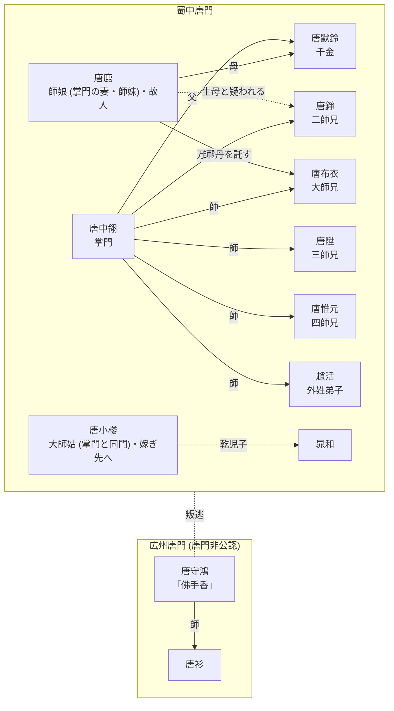
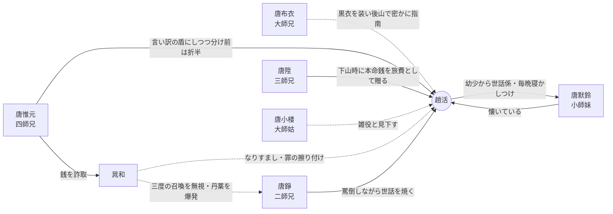
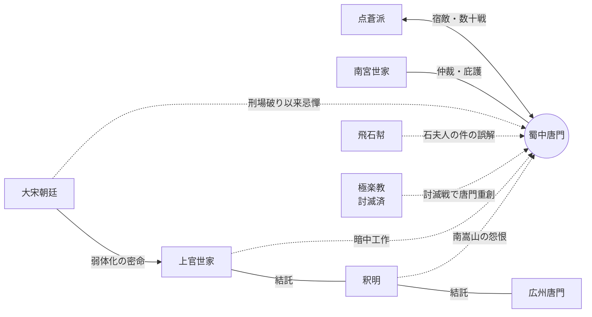

# {{ $frontmatter.title }}

::: warning ネタバレ注意
このページは物語終盤までの人物関係のネタバレを**区別なく**含みます。
:::

関係の種類ごとに図を分けています。1枚の図にすべての関係を詰め込むと読めなくなるため、「師承・家族」「対外的な因縁」のように図ごとに主題を固定しています。

- **実線** … 作中で確定している関係
- **破線** … 疑い・非公式・一方的な関係

## 蜀中唐門 — 師承・家族図

横の並びが同じ段の人物は同世代 (同じ輩分) です。同世代内の関係 (夫婦・同門) はノード内の肩書きに記しています。

- [唐鹿](/ja/people/characters/other10) は [唐中翎](/ja/people/characters/master) の師妹にして妻。[極楽教](/ja/people/factions/elysium-school) の『屍心丹』に中毒して支配されていた間に [唐錚](/ja/people/characters/brother2) を生んだと疑われた。[唐默鈴](/ja/people/characters/girl0) を [趙活](/ja/people/characters/player) に託した後、崖に身を投げた。
- [唐陞](/ja/people/characters/brother3) は刑場破りの折、まだ掌門就任前の [唐中翎](/ja/people/characters/master) が少年の [唐布衣](/ja/people/characters/brother1)・[唐錚](/ja/people/characters/brother2) を率いて救い出した縁で唐門に入った。
- [唐小楼](/ja/people/characters/aunt2) は講経楼に二十年座った大師姑。すでに嫁ぎ出たが折々戻っては輩分を振りかざす。子がなく、[晁和](/ja/people/characters/special208) を乾児子として溺愛している。
- 広州唐門は叛逃者「佛手香」[唐守鴻](/ja/people/characters/special812) が開いた分院で、唐門はこれを認めていない。弟子に [唐衫](/ja/people/characters/special811) がいる。
- 失伝した真の万霊丹は、[唐鹿](/ja/people/characters/other10) が [唐布衣](/ja/people/characters/brother1) に与えた一份だけが残る。同時に贈られたガラスの花は唐門の暗器『無形箭』。

## 蜀中唐門 — 弟子世代の間柄図

弟子世代どうしの個人間の間柄です。この図には段と世代の対応はありません。

- [唐布衣](/ja/people/characters/brother1) は何度も [趙活](/ja/people/characters/player) の背中を忘形篇で打ち、黒衣の者を装って後山で指南した。
- [唐錚](/ja/people/characters/brother2) は [趙活](/ja/people/characters/player) を「役立たず」「趙氏蠢豚」と罵るが、江陵の千金方に働き口を紹介するなど面倒見はよい。
- [唐陞](/ja/people/characters/brother3) は志気を失って下山する [趙活](/ja/people/characters/player) に、長年身につけていた本命銭を「複数の師兄の代わり」として旅費に持たせた。
- [唐惟元](/ja/people/characters/brother4) は言い逃れの際に [趙活](/ja/people/characters/player) を盾として推し出すが、その助力で [晁和](/ja/people/characters/special208) から詐取した銭は率先して半分を分ける。
- [唐默鈴](/ja/people/characters/girl0) は幼い頃から妹のように [趙活](/ja/people/characters/player) に預けられて世話され、毎晩窓の下でお話を聞いて眠る。趙活が窓の外に座っていることをずっと前から知っていた。
- [晁和](/ja/people/characters/special208) は [趙活](/ja/people/characters/player) になりすまして広州で偽造医薬を売り、[丐幇](/ja/people/factions/beggar-gang) と [嵩山派](/ja/people/factions/mount-song-sect) を煽動した争いの罪を擦り付けようとした。
- [唐小楼](/ja/people/characters/aunt2) は [趙活](/ja/people/characters/player) を低い身分の雑役と見なし、彼に良いことが起こるのを快く思わない。

## 蜀中唐門 — 対外因縁図

- [点蒼派](/ja/people/factions/dian-cang-sect) との宿怨は剣聖のだまし討ちに始まり、大小数十戦に及ぶ。衰退期の唐門に挑んだ点蒼剣聖 [無名](/ja/people/characters/special406) を掌門が打ち倒し、[南宮世家](/ja/people/factions/nan-gong-family) の仲裁の下で封剣隠退させた。
- [大宋](/ja/people/factions/song-dynasty) 朝廷は刑場破り以来唐門を忌憚し、[趙擴](/ja/people/characters/special817) が [上官世家](/ja/people/factions/shang-guan-family) に暗中での弱体化を命じた。上官世家は南嵩山の [釈明](/ja/people/characters/special826)、広州唐門と結託して難を起こした。
- [釈明](/ja/people/characters/special826) の怨恨は、若き日の [唐中翎](/ja/people/characters/master) が南嵩山寺に罪人を千里追殺した「南嵩山心魔」の一件に由来する。
- [飛石幇](/ja/people/factions/flying-stone-gang) との争いは、[唐布衣](/ja/people/characters/brother1) が家出した [石夫人](/ja/people/characters/special815) を保護したのを [石公遠](/ja/people/characters/special7) が拐かしと誤解したことによる。
- [極楽教](/ja/people/factions/elysium-school) 討滅戦で唐門は重創を受け、衰退の起点となった。
